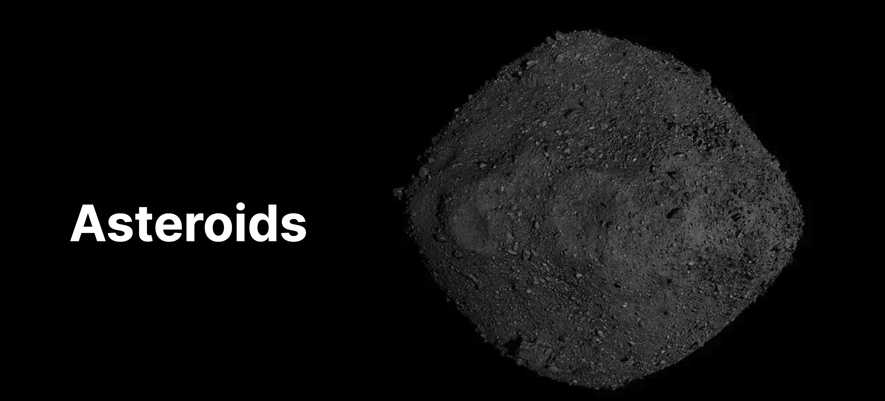
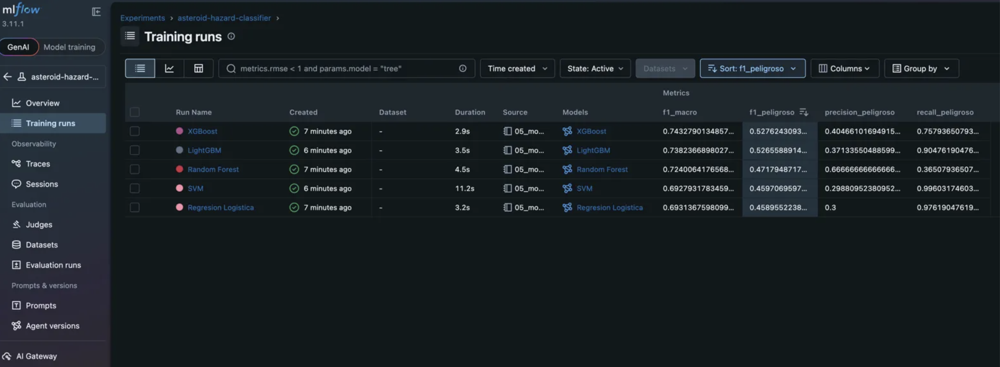

# Asteroid Hazard Classifier

Pipeline ML end-to-end para clasificar asteroides cercanos a la Tierra como potencialmente peligrosos, utilizando datos en tiempo real de la NASA.

Desarrollado en el contexto del lanzamiento de Artemis II (abril 2026).

En este contexto, “potencialmente peligroso” sigue la definición de la NASA para un Potentially Hazardous Asteroid (PHA): un objeto con una distancia mínima de intersección orbital (MOID) menor o igual a 0.05 AU y una magnitud absoluta H ≤ 22 (aproximadamente ≥ 140 metros de diámetro). Esta clasificación no implica un impacto inminente, sino que identifica objetos lo suficientemente grandes y cercanos como para requerir monitoreo.

En la práctica, organismos como el Center for Near Earth Object Studies realizan un seguimiento continuo de estos objetos, refinando sus órbitas a medida que se incorporan nuevas observaciones y evaluando probabilidades de impacto. La mayoría permanece en niveles de riesgo despreciables, pero esta clasificación permite priorizar el seguimiento y el análisis a largo plazo.

## Stack

Python 3.13, NASA NeoWs API, Supabase (PostgreSQL), scikit-learn,
XGBoost, LightGBM, MLflow, SHAP, Optuna, Plotly

## Resultados

Benchmark de 5 modelos. XGBoost seleccionado como modelo final.

| Métrica | Valor |
|---------|-------|
| F1 Macro | 0.753 |
| Recall clase peligroso | 0.929 |
| Precision clase peligroso | 0.370 |
| AUC-PR | 0.612 |
| Umbral de decisión | 0.20 |

El umbral 0.20 fue seleccionado por criterio de negocio: en detección
de asteroides peligrosos el costo de un falso negativo supera ampliamente
el costo de una falsa alarma.

## Estructura

    asteroid-classifier/
    ├── assets/
    │   └── MLFlow.png                  # Screenshot de MLflow experiment tracking
    ├── data/                           # Generado localmente, no se sube al repo
    │   ├── X_train.csv                 # Correr 04_preprocessing.ipynb para generar
    │   ├── X_test.csv
    │   ├── y_train.csv
    │   ├── y_test.csv
    │   ├── scaler.pkl
    │   └── xgboost_final.pkl
    ├── notebooks/
    │   ├── 01_api_exploration.ipynb    # Exploración inicial de la API
    │   ├── 02_etl.ipynb                # Pipeline ETL NASA API → Supabase
    │   ├── 03_eda.ipynb                # Análisis exploratorio
    │   ├── 04_preprocessing.ipynb     # Feature engineering y splits
    │   ├── 05_models.ipynb             # Benchmark de 5 modelos con MLflow
    │   ├── 06_shap.ipynb               # Interpretabilidad y análisis de errores
    │   ├── 07_optuna.ipynb             # Hyperparameter tuning bayesiano
    │   └── 08_visualizaciones.ipynb   # Visualizaciones interactivas con Plotly
    ├── sql/
    │   └── create_tables.sql           # Setup de tablas y RLS en Supabase
    ├── .env.example
    ├── requirements.txt
    └── README.md

## Instalación

1. Cloná el repo
2. Creá un entorno virtual: python -m venv venv
3. Activalo: source venv/bin/activate
4. Instalá dependencias: pip install -r requirements.txt
5. Copiá .env.example a .env y completá con tus credenciales
6. Ejecutá create_tables.sql en el SQL Editor de Supabase
7. Corré los notebooks en orden. IMPORTANTE: el 02_etl.ipynb
   solo debe correrse una vez. Los notebooks siguientes usan
   el dataset fijo guardado en data/asteroids_raw.csv.
8. Para visualizar los experimentos de MLflow:
   cd notebooks
   mlflow ui --host 127.0.0.1 --port 5001 --backend-store-uri sqlite:///mlflow.db
   Abrí http://127.0.0.1:5001

## Variables de entorno

    NASA_API_KEY=your_nasa_api_key
    SUPABASE_URL=your_supabase_url
    SUPABASE_KEY=your_supabase_key

## Dataset
Dataset fijo al 31 de marzo de 2026. El ETL no debe re-ejecutarse
salvo para reproducir desde cero con los mismos datos.

22.617 asteroides únicos, período 2021-2026, extraídos de NASA NeoWs API.
Desbalance de clases: 94.4% no peligrosos, 5.6% peligrosos.

## Experiment Tracking

## Decisiones de diseño

### Deduplicación por asteroide

El mismo asteroide puede tener múltiples close approaches en distintas
fechas. La unidad de análisis del modelo es el asteroide, no el evento
de acercamiento. Se conservó el primer acercamiento registrado por
asteroide (drop_duplicates(subset='id', keep='first')).

is_potentially_hazardous es una propiedad fija del objeto orbital, no
del evento, por lo que no se pierde información relevante para el modelo.

En un sistema productivo lo correcto sería una tabla separada para
eventos de acercamiento con FK a asteroides. Esta simplificación está
justificada para el alcance del proyecto.

### Feature store

Los datos raw (asteroids) y las features procesadas (asteroids_features)
viven en tablas separadas en Supabase. Cualquier notebook consume
asteroids_features directamente sin reprocesar.

### Umbral de decisión

El umbral por defecto de 0.50 fue reemplazado por 0.20 basándose en
criterio de negocio. Ver análisis completo en 06_shap.ipynb.

### Limitaciones conocidas

El modelo usa 4 features básicas disponibles en la API pública de NeoWs.
La API de JPL Small Body Database (https://ssd-api.jpl.nasa.gov/doc/sbdb.html)
expone features orbitales adicionales como excentricidad, inclinación y
semieje mayor que no fueron incorporadas en este pipeline. Incorporarlas
sería el paso natural para mejorar el poder predictivo más allá del
techo actual.